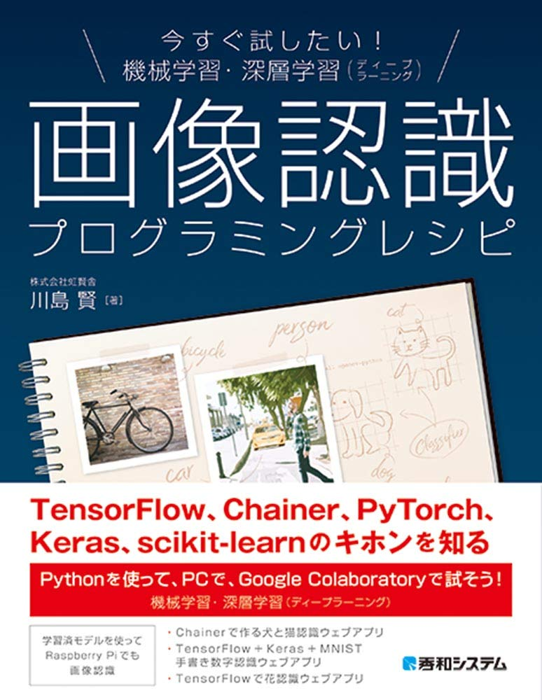

# book-ml

このレポジトリは、書籍「今すぐ試したい！機械学習・深層学習（ディープラーニング）画像認識プログラミングレシピ」のソースコードを配布するレポジトリです。

アマゾンのリンクはこちらです：https://www.amazon.co.jp/dp/4798056839



# フォルダーの説明

* Colaboratory：本書で使うJupyter NoteBookです。Google Colaboratoryにインポートして実行してください。インポートする方法は本書の96ページをご参照ください。
* docker-python3-flask-ml-app：04-05 節、04-06 節、05-01節、05-03 節のサンプルコードと関連するウェブアプリケーションプログラムソースコード。PCの場合は```docker-compose up```で起動させることができます（Dockerが必要です）。詳しくは本書の267ページの「Column」の説明をご参照ください。
* python：04-02 節と05-04 節と05-08 節と07-02 節のPythonプログラムのソースコード
* scripts：04-02 節のコマンドなどをまとめたファイル

詳しくは、それぞれのフォルダの中身をご確認ください。

Pull Request歓迎！

著者のTwitter：https://twitter.com/kokensha_tech
